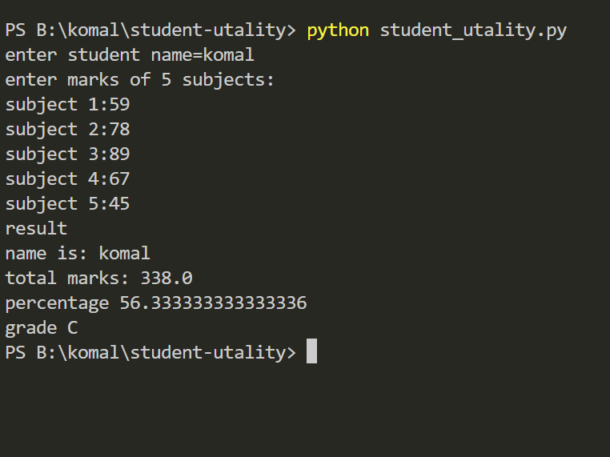

# Student Result Analyzer

## Description
This project calculates student marks and grade.

## Features
- Calculate total
- Calculate percentage
- Show grade

## How to Run
1. Open in Turbo C++ / VS Code
2. Compile the program
3. Run the program
4. Enter marks
5. View output

## Output
Enter marks: 70 80 90 85 75
Total = 400
Percentage = 80%
Grade = A

## Technologies Used
- C++

## Author
Komal Divase
## screenshot
